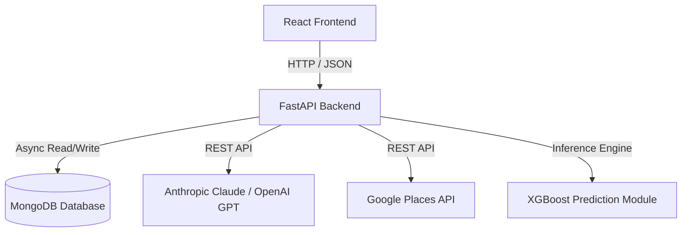

# Architecture Notes: RiskLens Platform

RiskLens is a multi-disease early prediction health platform. It provides patients and clinicians with:
- ML-driven risk scores (XGBoost) and visual risk factor attributions (SHAP).
- Interactive natural language health advice (Anthropic Claude or OpenAI GPT).
- Proximity hospital location and contact details (Google Places API).

## High-Level Architecture

The platform uses a decoupled monorepo architecture:

## Backend Organization

To keep the FastAPI application modular and scalable, it is organized **by feature**:

- `app/features/<feature_name>/`:
  - `routers.py`: Exposes HTTP endpoints.
  - `models.py`: Defines database schemas or entities.
  - `schemas.py`: Pydantic models for request/response serialization and validation.
  - `services.py`: Dedicated business logic (e.g. calculation engines, LLM client connections).

Shared modules (such as MongoDB database clients, standard authorization middleware, and global configuration definitions) are located inside `app/db/` and `app/core/`.
